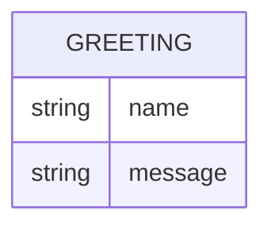

# Domain Model

Greeter has no persistent storage — every request is handled statelessly. The one shape that flows through the system is the greeting itself, shown here for completeness.

`Greeting` is a transient value, never stored: `name` is the (optional) caller-supplied name, and `message` is the generated greeting text returned in the response body.